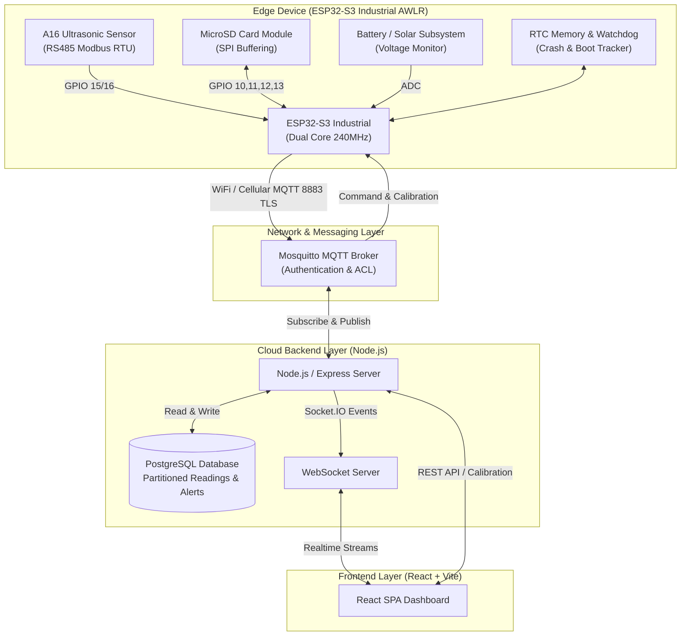
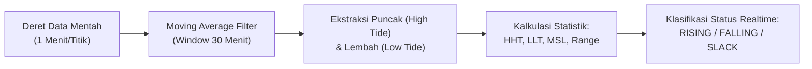

# 📋 Product Requirements Document (PRD)
# TerraFlow — Portable Automatic Water Level Recorder (AWLR) System

| Field | Detail |
|---|---|
| **Product Name** | **TerraFlow AWLR** |
| **Document Version** | 1.0.0 |
| **Status** | Approved / Ready for Implementation |
| **Target Hardware** | ESP32-S3 Industrial + A16 Ultrasonic River/Dam Sensor + SPI SD Card |
| **Target Software Stack** | Node.js (Express, Socket.IO, MQTT.js) + React (Vite) + PostgreSQL |
| **Target Domain** | Hidrologi, Pemantauan Pasang Surut Laut, Sungai, Bendungan, Mitigasi Banjir |

---

## 1. Executive Summary & Product Vision

### 1.1 Executive Summary
**TerraFlow** adalah sistem instrumen **Automatic Water Level Recorder (AWLR)** portabel industri yang dirancang untuk memantau ketinggian muka air secara kontinu (interval 1 menit) di lokasi terpencil atau pesisir pantai. Sistem ini mengintegrasikan mikrokontroler **ESP32-S3 Industrial**, sensor ultrasonik **A16 River/Dam (DYP-A16NY4W-V1.0)** via RS485 Modbus RTU, modul penyimpanan lokal **MicroSD (SPI)**, serta konektivitas IoT berbasis **MQTT**. 

Data dikirimkan ke arsitektur cloud/VPS terintegrasi berbasis **Node.js, PostgreSQL, dan React Dashboard** dengan fitur analitik pasang surut (*tidal analysis*), kalibrasi parameter jarak jauh (*remote calibration*), pemantauan kesehatan perangkat (*watchdog & diagnostics*), serta mekanisme *offline-buffering* otomatis yang menjamin nol kehilangan data (*zero data loss*).

### 1.2 Product Vision
Menjadi solusi AWLR portabel berstandar industri dengan keandalan operasional lapangan yang tinggi, tahan terhadap anomali jaringan dan cuaca ekstrem, serta menyajikan visualisasi data hidrologi dan oseanografi (*realtime & historical tidal data*) yang akurat, interaktif, dan mudah diakses oleh teknisi maupun analis.

---

## 2. Problem Statement, Target Personas & Use Cases

### 2.1 Problem Statement
1. **Ketidakstabilan Jaringan Lapangan**: Area pemasangan AWLR (muara sungai, pesisir laut, hulu bendungan) sering mengalami *blank spot* seluler atau pemadaman jaringan, menyebabkan lubang data (*data gaps*) pada sistem konvensional.
2. **Kebutuhan Kalibrasi Fleksibel**: Elevasi sensor berubah saat reposisi tiang atau pemasangan portabel, sehingga operator membutuhkan mekanisme kalibrasi offset dan slope dari antarmuka web tanpa harus mengunduh ulang firmware atau membongkar perangkat.
3. **Anomali Perangkat Tanpa Pengawasan**: Kegagalan sistem seperti *system freeze*, *watchdog reset*, penurunan tegangan aki (*brownout*), kabel sensor terputus, atau modul sensor mati di lapangan sering terlambat disadari tanpa sistem peringatan (*early error reporting*).
4. **Analisis Pasang Surut Kompleks**: Pemantauan air laut membutuhkan kalkulasi dinamika pasang surut (puncak pasang, titik surut, rentang pasut, *mean sea level*) yang membebani analis jika dilakukan secara manual.

### 2.2 Target Personas

| Persona | Role & Tanggung Jawab | Kebutuhan Utama |
|---|---|---|
| **Teknisi Lapangan (Field Engineer)** | Pemasangan perangkat, verifikasi kelistrikan, perawatan sensor | Status konektivitas, log diagnostik hardware, verifikasi pembacaan awal, kalibrasi instan |
| **Operator / Pengamat Hidrologi** | Monitoring harian ketinggian air sungai / laut | Dashboard interaktif, notifikasi alert bila level air kritis / sensor rusak, status baterai |
| **Analis Oseanografi & SDA** | Pengolahan tren pasang surut, debit air, studi hidrologi | Kurva pasang surut 24 jam, ekspor data CSV terfilter, kalkulasi HHT/LLT/MSL |
| **Administrator Sistem** | Manajemen armada alat (*fleet*), pengguna, dan infrastruktur cloud | Manajemen device ID, konfigurasi batas ambang (*thresholds*), audit log |

---

## 3. System Architecture Overview



---

## 4. Hardware Specifications & Interfaces

### 4.1 Perangkat Keras Utama
* **Mikrokontroler**: ESP32-S3 Industrial (Dual-Core Xtensa LX7 @240MHz, 8MB Flash, 2MB/8MB PSRAM, Wi-Fi 2.4GHz 802.11 b/g/n, Bluetooth 5.0 LE).
* **Sensor Ketinggian**: A16 Ultrasonic River/Dam Sensor (DYP-A16NY4W-V1.0).
  * Prinsip kerja: Gelombang ultrasonik frekuensi tinggi dengan kompensasi temperatur internal.
  * Jarak ukur: 50 cm – 1500 cm (Blind Zone: 50 cm).
  * Akurasi: $\pm(1 + S \times 0.3\%)$ cm.
  * Antarmuka: RS485 Industrial, Transceiver MAX485/SP3485.
  * Proteksi: IP67/IP68 *weatherproof* untuk instalasi luar ruangan.
* **Media Penyimpanan Lokal**: Modul MicroSD Card Industri (SPI mode, kapasitas 4GB–32GB FAT32).
* **Manajemen Daya**: Catu daya baterai 12V DC / Solar Panel charge controller dengan pemantau tegangan analog (*voltage divider* ke ADC ESP32).

### 4.2 Pemetaan Pin GPIO

| Komponen | Sinyal / Jalur | GPIO ESP32-S3 | Mode / Fungsi |
|---|---|---|---|
| **MicroSD Card** | SPI CS | **GPIO 10** | Output Chip Select |
| **MicroSD Card** | SPI MOSI | **GPIO 11** | Master Out Slave In |
| **MicroSD Card** | SPI MISO | **GPIO 12** | Master In Slave Out |
| **MicroSD Card** | SPI SCK | **GPIO 13** | SPI Clock |
| **RS485 Transceiver** | TX (ke RX A16) | **GPIO 15** | UART Transmit (Serial2) |
| **RS485 Transceiver** | RX (ke TX A16) | **GPIO 16** | UART Receive (Serial2) |
| **Sensor Tegangan Baterai** | BATT_ADC | **GPIO 4** (atau ADC1) | Analog Voltage Divider Read |
| **Status LED / Indikator** | LED_STATUS | **GPIO 2** | Indikator Online/Sync/Error |

---

## 5. Firmware Requirements & Logic Specifications

### 5.1 Siklus Pengukuran Normal (1 Menit)
1. **Sampling Interval**: Timer interrupt / FreeRTOS task berjalan setiap **60 detik**.
2. **Pembacaan Sensor**:
   * ESP32 mengirim request query frame RS485 ke modul A16 (Baudrate 9600 bps, 8N1).
   * Timeout pembacaan: 2.0 detik. Jika tidak merespons, lakukan percobaan hingga 3 kali.
3. **Perhitungan Water Level (Formula Kalibrasi)**:
   $$\text{Water Level (cm)} = \text{Sensor Height} - (\text{Raw Distance} \times \text{Slope} + \text{Offset})$$
   * Nilai parameter kalibrasi dibaca dari memory NVS (Non-Volatile Storage) ESP32.
4. **Penyimpanan Lokal (Offline-First Mandatory)**:
   * Setiap data pembacaan **WAJIB** ditulis langsung ke file harian MicroSD `/sd/data/YYYY-MM-DD.csv` dengan status awal flag `sent = 0`.
5. **Transmisi MQTT**:
   * Jika koneksi MQTT aktif: Publish ke topic `terraflow/{device_id}/data`.
   * Jika publish sukses terkonfirmasi: Perbarui baris record di SD card menjadi `sent = 1`.
   * Jika koneksi terputus: Biarkan `sent = 0`, inkremen counter `pending_count` pada `sync_pointer.json`.

### 5.2 Offline Buffering & Automatic Bulk Synchronization
* **Struktur File MicroSD**:
  * `/sd/data/YYYY-MM-DD.csv`: Berisi seluruh rekaman hari tersebut.
  * `/sd/sync_pointer.json`: Melacak file terakhir yang belum sinkron dan jumlah pending data.
  * `/sd/sent/`: Arsip file yang telah 100% tersinkronisasi (dihapus otomatis setelah rotasi 7–30 hari).
  * `/sd/logs/crash_YYYYMMDD.log`: Catatan audit kejadian watchdog, restart, dan error sistem.
* **Mekanisme Reconnect & Bulk Sync**:
  * Timer watchdog konektivitas melakukan pengujian koneksi setiap 5 menit saat offline.
  * Saat internet pulih dan koneksi MQTT tersambung kembali, sistem memicu FreeRTOS background task: `bulkSyncTask`.
  * Data `sent = 0` dikelompokkan ke dalam paket (*chunk*) maksimum **10 record per payload** agar ukuran pesan tetap di bawah batas aman MTU/broker (~2-4 KB).
  * Paket dikirim ke `terraflow/{device_id}/data/bulk`.
  * Sistem menunggu balasan dari server pada `terraflow/{device_id}/data/bulk/ack` dengan timeout 10 detik.
  * Setelah menerima ACK `status: ok`, sistem menandai record di SD Card sebagai `sent = 1`.
  * Diberikan *throttling delay* 200 ms antar paket guna mencegah kejenuhan transmisi (*network congestion*).

### 5.3 Watchdog Timer & Resilience Architecture
* **Dual Watchdog Layer**:
  * **Task Watchdog Timer (TWDT)**: Timeout 30 detik untuk mendeteksi *looping* tak terbatas atau kegagalan task.
  * **Interrupt Watchdog Timer (IWDT)**: Timeout 10 detik untuk mendeteksi blocking pada tingkat ISR.
* **RTC Fast Memory Persistence**: Variabel register RTC berikut bertahan (*survive*) melintasi watchdog reset dan brownout:
  * `boot_count`: Total boot sejak alat dinyalakan.
  * `watchdog_count`: Akumulasi frekuensi restart akibat WDT.
  * `brownout_count`: Akumulasi insiden penurunan tegangan daya.
  * `panic_count`: Akumulasi software panic / exception.
* **Penanganan Boot Reason**:
  * Saat startup, ESP mengecek `esp_reset_reason()`.
  * Jika reset disebabkan oleh WDT (`TG0WDT_SYS_RESET`), Brownout (`BROWNOUT_RST`), atau Panic (`SW_CPU_RESET`), sistem mencatat *crash dump* ke MicroSD dan menyiapkan payload alert berkategori `CRITICAL` untuk segera dikirim saat terhubung.

### 5.4 Matriks Kode Peringatan Lapangan (Field Alert Matrix)

| Kode Alert | Tingkat Keparahan | Pemicu (Trigger Condition) | Tindakan Pemulihan Otomatis |
|---|---|---|---|
| `WDT_RESET` | 🔴 **CRITICAL** | Terjadi restart akibat Task/Interrupt Watchdog | Auto-reboot, simpan log, kirim diagnostik pasca-boot |
| `SENSOR_FAIL` | 🔴 **CRITICAL** | Pembacaan sensor A16 gagal berturut-turut 5 kali | Siklus daya (*power cycle*) sensor via transistor/relay |
| `SENSOR_TIMEOUT`| 🟡 **WARNING** | RS485 tidak membalas dalam batas toleransi 2 detik | Lewati siklus saat ini, coba lagi pada interval berikutnya |
| `SENSOR_ANOMALY`| 🟡 **WARNING** | Lonjakan delta ketinggian air $>50\text{ cm}$ dalam 1 menit | Catat anomali, beri flag peringatan pada payload data |
| `BATTERY_LOW` | 🟡 **WARNING** | Tegangan baterai turun di bawah $11.5\text{ V}$ | Kirim peringatan peringatan daya |
| `BATTERY_CRITICAL`| 🔴 **CRITICAL** | Tegangan baterai turun di bawah $10.5\text{ V}$ | Kirim notifikasi darurat, aktifkan mode *Deep Sleep* |
| `BROWNOUT` | 🔴 **CRITICAL** | Suplai tegangan drop secara instan di bawah ambang batas | Logging RTC counter, restart terkontrol |
| `SD_CARD_FAIL` | 🔴 **CRITICAL** | Modul SD Card tidak merespons init atau read/write gagal | Beralih ke RAM Ring-Buffer (kapasitas 100 record) |
| `SD_CARD_FULL` | 🟡 **WARNING** | Sisa ruang kosong MicroSD $<10\text{ MB}$ | Eksekusi rotasi pembersihan berkas lama di direktori `/sd/sent/` |
| `WIFI_FAIL` | 🟡 **WARNING** | Kehilangan koneksi jaringan lebih dari 10 menit | Nyalakan mode hemat offline, coba rekoneksi tiap 5 menit |
| `MQTT_FAIL` | 🟡 **WARNING** | Gagal menyambung ke broker atau publish ditolak | Re-inisialisasi koneksi klien MQTT |
| `HEAP_LOW` | 🟡 **WARNING** | Sisa Free Heap memory $<20\text{ KB}$ (Restart paksa jika $<10\text{ KB}$) | Garbage collection, restart aman jika terjadi *memory leak* |
| `TEMP_HIGH` | 🟡 **WARNING** | Sensor temperatur internal ESP32 melampaui $60^\circ\text{C}$ | Log peringatan suhu ekstrem |
| `NTP_FAIL` | ℹ️ **INFO** | Gagal sinkronisasi waktu NTP lebih dari 24 jam berturut-turut | Menggunakan waktu acuan RTC internal |

---

## 6. MQTT Protocol & Data Schemas

### 6.1 Hirarki Topic MQTT

```
terraflow/
└── {device_id}/
    ├── data                    # Telemetri realtime 1-menit (ESP → Server)
    ├── data/bulk               # Pengiriman data tunda batch offline (ESP → Server)
    ├── data/bulk/ack           # Konfirmasi penerimaan chunk batch (Server → ESP)
    ├── status                  # Heartbeat status koneksi LWT (ESP → Server)
    ├── alert                   # Pesan insiden darurat & warning (ESP → Server)
    ├── diagnostics             # Laporan diagnostik hardware rutin & boot (ESP → Server)
    ├── calibration/
    │   ├── set                 # Perintah perubahan parameter kalibrasi (Web → ESP)
    │   ├── get                 # Permintaan pembacaan parameter aktif (Web → ESP)
    │   └── response            # Konfirmasi parameter kalibrasi saat ini (ESP → Web)
    └── command/
        ├── restart             # Perintah restart instrumen jarak jauh (Web → ESP)
        └── sync_request        # Perintah paksa pemicu sinkronisasi SD (Web → ESP)
```

### 6.2 Spesifikasi Payload JSON

#### A. Telemetri Realtime: `terraflow/{device_id}/data`
```json
{
  "device_id": "AWLR-001",
  "timestamp": 1791334800,
  "raw_distance_cm": 420.50,
  "water_level_cm": 179.50,
  "temperature_c": 29.20,
  "battery_voltage": 12.45,
  "battery_percent": 88,
  "signal_quality": -68,
  "sd_status": "ok",
  "reading_count": 1440,
  "source": "live"
}
```

#### B. Pengiriman Batch Offline: `terraflow/{device_id}/data/bulk`
```json
{
  "device_id": "AWLR-001",
  "batch_id": "20261007_0900_01",
  "chunk": 1,
  "total_chunks": 12,
  "source": "sd_buffer",
  "file_date": "2026-10-07",
  "records": [
    {
      "timestamp": 1791331200,
      "raw_distance_cm": 425.10,
      "water_level_cm": 174.90,
      "temperature_c": 28.90,
      "battery_voltage": 12.48,
      "battery_percent": 89
    },
    {
      "timestamp": 1791331260,
      "raw_distance_cm": 424.80,
      "water_level_cm": 175.20,
      "temperature_c": 28.90,
      "battery_voltage": 12.47,
      "battery_percent": 89
    }
  ]
}
```

#### C. Balasan Konfirmasi Batch: `terraflow/{device_id}/data/bulk/ack`
```json
{
  "device_id": "AWLR-001",
  "batch_id": "20261007_0900_01",
  "chunk": 1,
  "status": "ok",
  "records_saved": 2
}
```

#### D. Laporan Peringatan Masalah: `terraflow/{device_id}/alert`
```json
{
  "device_id": "AWLR-001",
  "timestamp": 1791334812,
  "alert_code": "WDT_RESET",
  "severity": "CRITICAL",
  "message": "Watchdog timeout terdeteksi. Task pembacaan sensor terhambat melebihi 30s.",
  "details": {
    "boot_count": 15,
    "watchdog_count": 1,
    "free_heap_bytes": 142100,
    "uptime_before_crash_sec": 43200
  },
  "resolved": false
}
```

#### E. Konfigurasi Kalibrasi: `terraflow/{device_id}/calibration/set`
```json
{
  "cmd": "set_calibration",
  "sensor_height_cm": 600.00,
  "offset_cm": 1.25,
  "slope": 0.9985,
  "timestamp": 1791334900
}
```

---

## 7. Web Platform Architecture (Backend & Frontend)

### 7.1 Evaluasi & Justifikasi Stack Teknologi
* **Backend: Node.js + Express**:
  * Dipilih menggantikan model konvensional PHP/Laravel karena kebutuhan arsitektur IoT yang *event-driven*.
  * Node.js mampu menjalankan subscriber MQTT persisten (`mqtt.js`), REST API, dan koneksi dua arah WebSocket (`Socket.IO`) dalam satu thread loop runtime tanpa memerlukan supervisor daemon terpisah.
* **Database: PostgreSQL**:
  * Sangat andal menangani beban *time-series data* (1 data/menit = 525.600 baris/tahun per instrumen).
  * Dilengkapi kapabilitas partisi tabel bulanan (*Range Partitioning*) dan indexing komposit berkecepatan tinggi.
* **Frontend: React + Vite**:
  * *Single Page Application* (SPA) dengan performa render dinamis untuk visualisasi kurva pasang surut, live gauge, dan filter rentang tanggal tanpa re-load halaman.
  * *Design Language*: Tema modern bernuansa *Industrial Dark Mode* (`#0f172a`), aksen biru hidrologi (`#3b82f6`), dan sentuhan *glassmorphism*.

### 7.2 Skema Database Relasional

```sql
-- 1. Tabel Registrasi Perangkat AWLR
CREATE TABLE devices (
    id UUID PRIMARY KEY DEFAULT gen_random_uuid(),
    device_id VARCHAR(50) UNIQUE NOT NULL,
    name VARCHAR(100) NOT NULL,
    location VARCHAR(200),
    latitude DECIMAL(10, 7),
    longitude DECIMAL(10, 7),
    sensor_height_cm DECIMAL(8, 2) DEFAULT 600.00,
    is_active BOOLEAN DEFAULT true,
    last_seen TIMESTAMPTZ,
    created_at TIMESTAMPTZ DEFAULT NOW(),
    updated_at TIMESTAMPTZ DEFAULT NOW()
);

-- 2. Tabel Telemetri Sensor (Partisi Bulanan)
CREATE TABLE readings (
    id BIGSERIAL,
    device_id VARCHAR(50) NOT NULL REFERENCES devices(device_id),
    timestamp TIMESTAMPTZ NOT NULL,
    raw_distance_cm DECIMAL(8, 2),
    water_level_cm DECIMAL(8, 2),
    temperature_c DECIMAL(5, 2),
    battery_voltage DECIMAL(5, 2),
    battery_percent SMALLINT,
    signal_quality SMALLINT,
    sd_status VARCHAR(10),
    reading_count INTEGER,
    source VARCHAR(20) DEFAULT 'live',
    created_at TIMESTAMPTZ DEFAULT NOW(),
    PRIMARY KEY (id, timestamp),
    UNIQUE (device_id, timestamp)
) PARTITION BY RANGE (timestamp);

-- Contoh Partisi Tabel Berdasarkan Bulan
CREATE TABLE readings_2026_10 PARTITION OF readings
    FOR VALUES FROM ('2026-10-01') TO ('2026-11-01');

-- 3. Tabel Riwayat Kalibrasi
CREATE TABLE calibrations (
    id SERIAL PRIMARY KEY,
    device_id VARCHAR(50) NOT NULL REFERENCES devices(device_id),
    sensor_height_cm DECIMAL(8, 2) NOT NULL,
    offset_cm DECIMAL(8, 2) DEFAULT 0.00,
    slope DECIMAL(8, 6) DEFAULT 1.000000,
    applied_at TIMESTAMPTZ DEFAULT NOW(),
    applied_by VARCHAR(100),
    notes TEXT,
    is_active BOOLEAN DEFAULT true
);

-- 4. Tabel Kejadian Peringatan & Kesalahan (Device Alerts)
CREATE TABLE device_alerts (
    id BIGSERIAL PRIMARY KEY,
    device_id VARCHAR(50) NOT NULL REFERENCES devices(device_id),
    timestamp TIMESTAMPTZ NOT NULL,
    alert_code VARCHAR(30) NOT NULL,
    severity VARCHAR(10) NOT NULL,     -- 'CRITICAL', 'WARNING', 'INFO'
    message TEXT NOT NULL,
    details JSONB,
    resolved BOOLEAN DEFAULT false,
    resolved_at TIMESTAMPTZ,
    resolved_by VARCHAR(100),
    created_at TIMESTAMPTZ DEFAULT NOW()
);

-- 5. Tabel Snapshot Diagnostik Perangkat
CREATE TABLE device_diagnostics (
    id BIGSERIAL PRIMARY KEY,
    device_id VARCHAR(50) NOT NULL REFERENCES devices(device_id),
    timestamp TIMESTAMPTZ NOT NULL,
    boot_reason VARCHAR(30),
    uptime_sec INTEGER,
    boot_count INTEGER,
    watchdog_count INTEGER,
    brownout_count INTEGER,
    panic_count INTEGER,
    free_heap_bytes INTEGER,
    wifi_rssi SMALLINT,
    sd_card_ok BOOLEAN,
    sensor_ok BOOLEAN,
    battery_voltage DECIMAL(5, 2),
    esp_temp_c DECIMAL(5, 2),
    pending_unsent INTEGER,
    firmware_version VARCHAR(20),
    created_at TIMESTAMPTZ DEFAULT NOW()
);

-- Index Penting untuk Akses Cepat
CREATE INDEX idx_readings_device_time ON readings (device_id, timestamp DESC);
CREATE INDEX idx_alerts_device_status ON device_alerts (device_id, resolved, severity);
CREATE INDEX idx_calibrations_active ON calibrations (device_id, is_active);
```

---

## 8. Tidal Analysis (Analisis Pasang Surut) Specifications

Sistem menyajikan modul analitik oseanografi untuk mendeteksi perilaku gelombang pasang surut secara otomatis dari deret waktu pembacaan ketinggian air:



### 8.1 Algoritma Deteksi Puncak & Lembah (*Peak and Trough Detection*)
1. **Peredaman Noise (*Smoothing*)**: Nilai ketinggian air diratakan menggunakan filter rata-rata bergerak (*moving average*) dengan *window* 30 menit ($N=30$ titik sampel) guna mengeliminasi riak gelombang pendek (*wind waves / surface ripples*).
2. **Identifikasi Ekstremum Lokal**:
   * **Puncak Pasang (*High Tide*)**: Titik $y_i$ di mana $y_i > y_{i-1}$ dan $y_i > y_{i+1}$.
   * **Titik Surut (*Low Tide*)**: Titik $y_i$ di mana $y_i < y_{i-1}$ dan $y_i < y_{i+1}$.
3. **Penghitungan Periode Pasut (*Tidal Period*)**:
   Mengukur selisih waktu rata-rata antara dua puncak berturut-turut ($\Delta t \approx 12.4\text{ jam}$ untuk tipe pasut semi-diurnal).
4. **Indikator Dinamika Saat Ini**:
   * **RISING (🔺 PASANG)**: $\Delta \text{Level} > +0.5\text{ cm}$ dalam 5 menit terakhir.
   * **FALLING (🔻 SURUT)**: $\Delta \text{Level} < -0.5\text{ cm}$ dalam 5 menit terakhir.
   * **SLACK (➡️ TENANG / AIR MATI)**: $|\Delta \text{Level}| \le 0.5\text{ cm}$.

### 8.2 Parameter Statistik Pasang Surut
* **Highest High Tide (HHT)**: Nilai pasang maksimum mutlak dalam rentang analisis bulanan.
* **Lowest Low Tide (LLT)**: Nilai surut terendah mutlak dalam rentang analisis bulanan.
* **Mean Sea Level (MSL)**: Rata-rata aritmatika seluruh pembacaan elevasi air laut:
  $$\text{MSL} = \frac{1}{N}\sum_{i=1}^{N} \text{Water Level}_i$$
* **Tidal Range**: Rentang elevasi dinamis pasang surut: $\text{Range} = \text{HHT} - \text{LLT}$.

---

## 9. Web Feature Requirements & User Interface

### 9.1 Halaman Dashboard Utama (Realtime Monitor)
* **Water Level Gauge**: Radial gauge interaktif dengan indikasi zona elevasi (Normal, Waspada, Siaga, Bahaya).
* **Tidal Status Badge**: Label status dinamis `🔺 PASANG SEDANG NAIK`, `🔻 SURUT`, atau `➡️ SLACK WATER`.
* **Realtime Sparkline Chart**: Grafik pergerakan air 60 menit terakhir yang bergulir secara otomatis melalui Socket.IO.
* **Card Metrik Operasional**: Menampilkan parameter terkini: Jarak Sensor (cm), Temperatur Sensor/Air (°C), Tegangan Aki & Persentase Baterai (V / %), dan Kualitas Sinyal RSSI (dBm).
* **Device Health Banner**: Indikator instan bila ada insiden `CRITICAL` atau `WARNING` yang belum diselesaikan.

### 9.2 Halaman Analisis Pasang Surut (Tidal Curve)
* **24-Hour Tidal Curve Area Chart**: Menampilkan kurva gelombang air 24 jam dengan kontur gradien warna, titik puncak ditandai pin merah/biru, serta garis proyeksi rata-rata.
* **Tabel Jadwal Pasang-Surut**: Menampilkan daftar jam kejadian puncak pasang dan surut harian beserta nilai elevasi aktualnya.
* **Monthly Tidal Calendar Heatmap**: Tampilan kalender 30 hari di mana intensitas warna mencerminkan ketinggian maksimum air pasang untuk memantau siklus pasang purnama (*spring tide*) dan pasang perbani (*neap tide*).
* **Ringkasan Oseanografi**: Kartu statistik HHT, LLT, MSL, dan Tidal Range.

### 9.3 Halaman Kalibrasi Jarak Jauh (Remote Calibration)
* **Status Kalibrasi Aktif**: Menampilkan parameter operasional terpasang: Tinggi Tiang Referensi (*Sensor Height*), Faktor Koreksi Gradien (*Slope*), dan Pergeseran Titik Nol (*Offset*).
* **Formulir Penyesuaian**: Input numerik dengan batas validasi aman (*safety bounds*):
  * $50.0 \le \text{Sensor Height} \le 2000.0\text{ cm}$
  * $-100.0 \le \text{Offset} \le 100.0\text{ cm}$
  * $0.800 \le \text{Slope} \le 1.200$
* **Live Calculation Simulator**: Preview kalkulasi ketinggian air secara real-time terhadap pembacaan mentah saat nilai form diubah sebelum dieksekusi ke alat.
* **Tombol Push Kalibrasi**: Mengirim payload kalibrasi via MQTT topic `terraflow/{device_id}/calibration/set` dan menampilkan modal konfirmasi ACK dari perangkat ESP32.
* **Log Audit Riwayat Kalibrasi**: Tabel riwayat pencatatan setiap perubahan parameter, nama operator, timestamp, dan catatan perubahan.

### 9.4 Halaman Riwayat Data & Ekspor (Historical & Export)
* **Filter Rentang Tanggal & Waktu**: Pemilih rentang waktu fleksibel (Hari ini, 7 hari terakhir, 30 hari, kustom).
* **Grafik Interaktif Zoom & Pan**: Mampu memeriksa lonjakan air lampau hingga tingkat resolusi per-menit.
* **Tabel Tabulasi Data**: Menampilkan data historis dengan penanda asal data (`live` vs `sd_buffer`).
* **Ekspor CSV Terstandar**: Menghasilkan berkas CSV terstruktur dengan format tanggal ISO 8601, nilai elevasi, dan data pendukung untuk analisis software hidrologi eksternal (HEC-RAS, Delft3D).

### 9.5 Halaman Diagnostik Perangkat & Manajemen Peringatan (Alerts & Health)
* **Active Alerts Console**: Daftar peringatan yang masih aktif dengan opsi tombol `Acknowledge / Mark Resolved`.
* **Hardware Diagnostic Timeline**: Grafik riwayat reboot perangkat, mencatat kategori pemicu restart (Normal Power-On, Watchdog Timeout, Brownout Baterai, Software Panic).
* **Grafik Tren Kesehatan Baterai & Suhu**: Analisis degradasi baterai harian guna mengantisipasi penggantian aki sebelum alat mati total di lokasi terpencil.
* **Aksi Kontrol Jarak Jauh**: Tombol pengiriman perintah darurat `Reboot Device` dan `Force Sync SD Card`.

---

## 10. Non-Functional Requirements & Security

### 10.1 Keamanan & Integritas Data
* **Enkripsi Komunikasi MQTT**: Menggunakan protokol TLS/SSL port 8883.
* **Otentikasi & Otorisasi Broker**: Mosquitto dikonfigurasi dengan Access Control List (ACL) ketat; setiap device ID hanya berhak mempublikasikan dan menerima topik pada namespace miliknya sendiri.
* **Enkripsi NVS ESP32**: Kredensial WiFi dan token MQTT dienkripsi pada partisi Non-Volatile Storage ESP32-S3.
* **Keamanan Backend API**:
  * Penggunaan parameter kueri terikat (*parameterized SQL*) untuk pencegahan SQL Injection.
  * Sanitasi input ketat pada form kalibrasi guna mencegah *parameter tampering*.
  * Konfigurasi HTTP headers keamanan (Helmet, CORS spesifik origin, Content-Security-Policy).

### 10.2 Keandalan & Kapasitas Penyimpanan
* **Efisiensi Penyimpanan MicroSD**:
  * Format CSV rata-rata mengonsumsi $\approx 100\text{ byte per record}$.
  * Dalam 1 tahun (525.600 record) $\approx 52.5\text{ MB}$.
  * Kartu MicroSD industri 16 GB memiliki kapasitas teoritis untuk menampung data hingga **$>300\text{ tahun}$**, menjamin perangkat tidak akan pernah kehabisan kapasitas penyimpanan lokal.
* **Toleransi Pemadaman Jaringan**: Mampu beroperasi secara mandiri (*standalone offline*) tanpa koneksi internet selama berbulan-bulan, dan secara otomatis melakukan sinkronisasi *catch-up* bertahap tanpa membebani memori RAM mikrokontroler.

---

## 11. Testing & Simulation Strategy

Guna memastikan pengembangan frontend dan backend dapat berlangsung secara independen tanpa ketergantungan pada unit fisik ESP32 di tahap awal, disediakan **AWLR Hardware Simulator (Node.js)**:
1. **Generator Kurva Pasut Sinusoidal**: Mensimulasikan dinamika pasang surut realistis berperiode 12.4 jam dengan sedikit variasi acak (*noise*).
2. **Simulasi Kegagalan Jaringan**: Menguji skenario pemutusan koneksi buatan selama 6 jam untuk memverifikasi akumulasi record pending dan uji ketahanan bulk upload.
3. **Simulasi Error Terkendali**: Injeksi buatan pesan insiden `WDT_RESET`, `BATTERY_LOW`, dan `SENSOR_FAIL` untuk menguji reaktivitas antarmuka dashboard dan notifikasi pengguna.

---

## 12. Implementation Roadmap & Milestones

| Fase | Durasi | Target Capaian (Deliverables) |
|---|---|---|
| **Fase 1: Backend Foundation & DB** | Minggu 1 | Penyiapan Express, koneksi PostgreSQL, skema migrasi tabel, MQTT subscriber/publisher |
| **Fase 2: Hardware Simulator & MQTT Testing** | Minggu 1-2 | Skrip simulator penghasil data pasut, bulk upload tester, verifikasi ingest data |
| **Fase 3: Frontend Dashboard & Realtime** | Minggu 2 | Setup React Vite, implementasi Socket.IO hook, Water Level Gauge, grafik realtime, indikator pasut |
| **Fase 4: Modul Analisis Pasang Surut** | Minggu 3 | API kalkulasi puncak/lembah, 24-hr area chart, monthly calendar heatmap, metrik HHT/LLT/MSL |
| **Fase 5: Kalibrasi & Riwayat Data** | Minggu 3-4 | Form kalibrasi dua arah via MQTT, tabel riwayat, export CSV, date range filtering |
| **Fase 6: Modul Diagnostik & Manajemen Alert** | Minggu 4 | Ingest alert, panel daftar insiden, grafik tren baterai dan reboot reason |
| **Fase 7: Firmware Reference ESP32-S3** | Minggu 5 | Driver Modbus A16, sistem rotasi SD Card CSV, offline sync state machine, Watchdog RTC tracking |
| **Fase 8: Integrasi Akhir & Uji Lapangan** | Minggu 6 | Uji ketahanan perangkat (*soak testing*), pengujian *zero data loss*, dokumentasi manual teknisi |

---

## 13. Acceptance Criteria

* [ ] **Akurasi & Integritas Data**: Seluruh pembacaan 1 menit tersimpan di SD Card dan tersinkronisasi 100% ke PostgreSQL tanpa kehilangan data pasca pemadaman jaringan buatan.
* [ ] **Kalibrasi Jarak Jauh**: Perubahan nilai tinggi tiang, slope, dan offset melalui web langsung diterima oleh ESP32 dalam $<3\text{ detik}$ (saat online) dan tersimpan ke NVS.
* [ ] **Ketahanan Watchdog**: Jika task sensor macet, mikrokontroler me-reboot dalam batas 30 detik, mendeteksi pemicu `TG0WDT_SYS_RESET`, dan mengirimkan laporan insiden ke dashboard.
* [ ] **Analitik Pasang Surut**: Sistem mampu mengidentifikasi status naik/turun muka air serta menetapkan titik pasang dan surut harian secara otomatis.
* [ ] **Visualisasi Realtime**: Pembaruan elevasi air dan status operasional di dashboard web terjadi secara instan tanpa perlu memuat ulang peramban (*zero browser refresh*).
